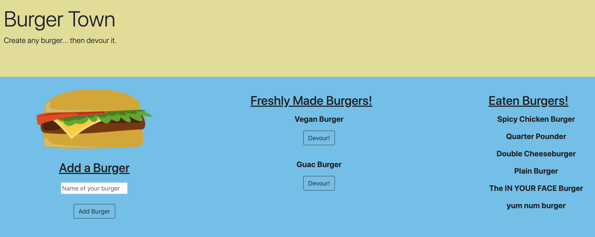

# Eat-Da-Burger App

_Full Stack Application_

#### Heroku App Link:
* https://burger-app-1-bluecam.herokuapp.com/

### About

This application demonstrates the use of API routing with CRUD methods. 

### Technologies Used

* Node JS: Helps manage application outside of browser.

* MySQL: Database managing new burgers and devoured status. 

* ORM: Helps manage manipulation of database.

* Handlebars: Template management. 

